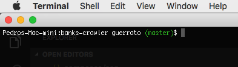

# Showing the Git branch in mac terminal

It's quite easy to configure your Mac terminal to show the GIT branch which you're working. 
Include at the end of your **.bash_profile** and it will work very well. To do it, follow the steps:

## Step 1 - Check if your .bash_profile exists

Check if it exists using the command:
```ls ~/.bash_profile```
If your .bash_profile doesn't exists, execute:
```touch ~/.bash_profile```

## Step 2 - Include the code to show the Git Branches

``` 
parse_git_branch() {
     git branch 2> /dev/null | sed -e '/^[^*]/d' -e 's/* \(.*\)/ (\1)/'
}

export PS1="\h:\W \u\[\033[32m\]\$(parse_git_branch)\[\033[00m\]$ " 

```

## Step 3 - Just check!

The easiest way to do it is closing and reopennig your terminal window. Open any folder that contains a valid .git and check if it is working.

It should look like the image below:

