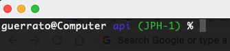

# Showing the Git branch in ZSH terminal
After Mac Catalina version the default terminal is the ZSH, so to show the GIT branch which into the ZSH terminal follow the steps:

## Step 1 - Check if your .bash_profile exists

Check if it exists using the command:

```
ls ~/.zshrc
```

If your .zshrc doesn't exists, execute:
```
touch ~/.zshrc
```

## Step 2 - Include the code to show the Git Branches

With the command vim, open the file ~/.zshrc:

```
vim ~/.zshrc
```
Insert the code below in the end of the file:

``` 
autoload -Uz vcs_info
precmd() { vcs_info }
zstyle ':vcs_info:git:*' formats " (%b)"
setopt PROMPT_SUBST
PROMPT='%n@%m %F{blue}%1~%f%F{green}${vcs_info_msg_0_}%f %# '

```

## Step 3 - Just check!

The easiest way to do it is closing and reopennig your terminal window, however the beatiful way is:
```
source ~/.zshrc
```
Please, use it! 

Open any folder that contains a valid .git and check if it is working.

It should look like the image below:




# Showing the Git branch in BASH terminal

It's quite easy to configure your Mac bash terminal to show the GIT branch which you're working. 
Include at the end of your **.bash_profile** and it will work very well. To do it, follow the steps:

## Step 1 - Check if your .bash_profile exists

Check if it exists using the command:

```
ls ~/.bash_profile
```

If your .bash_profile doesn't exists, execute:
```
touch ~/.bash_profile
```

## Step 2 - Include the code to show the Git Branches

With the command vim, open the file ~/.bash_profile:

```
vim ~/.bash_profile
```
Insert the code below in the end of the file:

``` 
parse_git_branch() {
     git branch 2> /dev/null | sed -e '/^[^*]/d' -e 's/* \(.*\)/ (\1)/'
}

export PS1="\h:\W \u\[\033[32m\]\$(parse_git_branch)\[\033[00m\]$ " 

```

## Step 3 - Just check!

The easiest way to do it is closing and reopennig your terminal window. Open any folder that contains a valid .git and check if it is working.

It should look like the image below:


